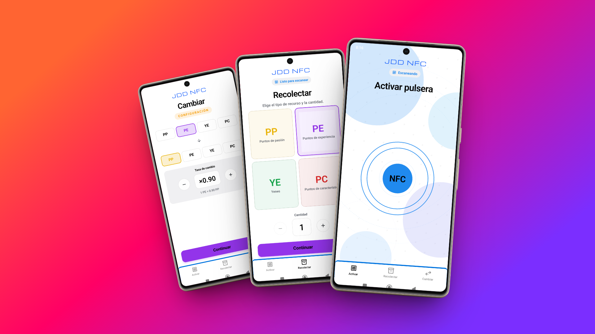
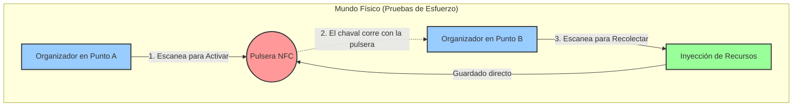

<div align="center">
  <!--  -->
  
  <h1>Inazuma Eleven Endavant: App NFC de Recolección</h1>
  
  <p>
    
    
    
    
  </p>
</div>

Bienvenido al repositorio de la **App NFC de Recolección**, una herramienta satélite fundamental dentro del ecosistema de **Inazuma Eleven Endavant**. Esta aplicación móvil, desarrollada en React Native, está diseñada para ser utilizada por los organizadores del evento a pie de campo.

Mientras la plataforma web principal gestiona la economía, el progreso RPG y los partidos de chapas, esta aplicación actúa como el puente físico que recompensa el esfuerzo de los chavales (carreras, pruebas) inyectando recursos en su mundo digital.

<div align="center">
  
</div>
<div align="center">
  <p><i>Interfaces de la App: Activación, Recolección y Cambio de Divisas</i></p>
</div>

---

## 🏃 Características y Mecánica de Pruebas

La app está diseñada para ser ultra-rápida y a prueba de errores en exteriores. Su principal característica es traducir el esfuerzo físico en Yenes (YE), Puntos de Experiencia (PE), Puntos de Pasión (PP) y Puntos de Características (PC).

La mecánica (la "Carrera NFC") se divide en dos fases distribuidas en el espacio físico:



1. **Activación de la Misión**: Un chaval se dirige al "Punto A". El organizador, con su teléfono en modo _Activar_, acerca el dispositivo a la pulsera del jugador, cambiando el estado interno de la pulsera a "activa".
2. **Esfuerzo Físico**: El jugador realiza una prueba, como un sprint hasta el otro extremo del campamento o un recorrido de obstáculos.
3. **Recompensa (Recolección)**: Al llegar al "Punto B", otro organizador utiliza la app en modo _Recolectar_. Al escanear, la app verifica que la pulsera estuviera activa, consume la activación, y suma de forma segura la cantidad de recursos al inventario interno de la pulsera.

---

## 📻 Tecnología NFC y Pulseras

Para garantizar que el juego fluya incluso en mitad del bosque o en zonas del campamento sin cobertura móvil, el sistema **no requiere internet**.

En lugar de consultar constantemente una base de datos centralizada para estas mecánicas, **la propia pulsera funciona como base de datos y cartera digital**.

- **Protocolo NDEF**: Las pulseras almacenan la información mediante mensajes estandarizados NDEF (NFC Data Exchange Format). La app de React Native, utilizando `react-native-nfc-manager`, lee y reescribe estos mensajes al instante al acercar el teléfono.
- **Carga útil JSON**: Cada pulsera almacena un objeto JSON plano serializado que contiene el estado del jugador y sus recursos.
  ```json
  {
    "active": false,
    "team": 1,
    "ye": 1500,
    "pe": 3,
    "pp": 10,
    "pc": 2
  }
  ```
- **Offline-First Extremo**: Gracias a esta aproximación tecnológica, la app es infalible ante las caídas de red. Las operaciones son inmediatas (apenas la latencia de radiofrecuencia del chip), garantizando que una fila de 30 niños sudando en mitad del campo pueda ser escaneada y recompensada en cuestión de segundos por un solo educador.

---

## 🔗 Integración en el Ecosistema Híbrido

Esta aplicación no opera aislada del ecosistema general. Al utilizar las pulseras como un medio físico para transportar datos, los recursos obtenidos interactúan posteriormente con la infraestructura central en NestJS y Next.js:

1. **Recolección en Campo**: Los jugadores acumulan Yenes (`ye`), Experiencia (`pe`) o Pasión (`pp`) en la pulsera corriendo entre los organizadores gracias a esta App.
2. **El "Vuelco" de Datos (Sincronización)**: Cuando el jugador termina sus actividades y acude al "Mercado" (el puesto de administración central donde sí hay conexión a internet), un administrador escanea su pulsera.
3. **Carga en la Nube**: Los recursos acumulados localmente en la pulsera NFC se extraen, se actualizan en el backend de Inazuma Eleven (PostgreSQL) y la pulsera se vacía o descuenta.
4. **Impacto Tangible**: Ahora el jugador cuenta con el dinero digital en su panel web, lo que le permite fichar a un nuevo delantero en el mercado o comprar consumibles para ganar su próximo partido físico de chapas en los estadios.
